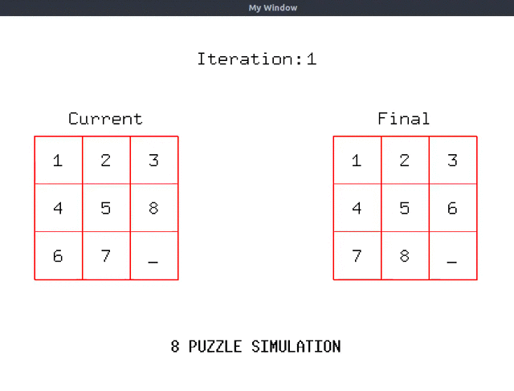

## 8 Puzzle Problem

Implemented simulation of A* algorithm on 8 puzzle problem using Nielson heuristic in python language.

It shows each step from initial state to final state with adjacent movement in each step. Delay has been added in each step.


#### Input File Format:

> First line contains initial state <br>
> Second line contains final state

Example:
> 1 2 3 4 _ 5 6 8 7  
> _ 1 3 4 2 5 6 8 7

Execute by:
```
python 8puzzle.py
```


Sample Output 1:


Sample Output 2:


Created is made by me and [Pranav Gupta](https://github.com/foobar98)
